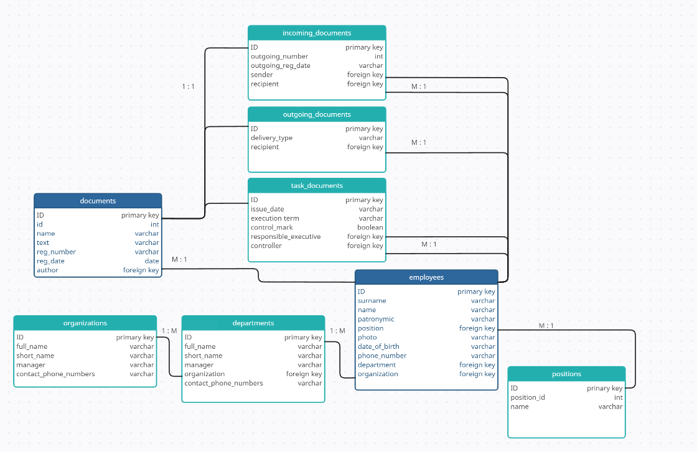

# Documents

Pet-проект для работы с документами. В приложении можно создавать, читать, редактировать и удалять 3 вида документов 
(Входящий, исходящий, поручение).
Реализована оргструктура (сотрудник, подразделение, организация, должность).

Для пользователей реализована аутентификация и авторизация. Сущность пользователя связывается с сотрудником.

Технические решения: 
* Java 19
* Spring Boot
* Spring Security
* PostgreSQL
* Hibernate
* Mapstruct
* Maven
* JAXB
* Liquibase
* JUnit5

